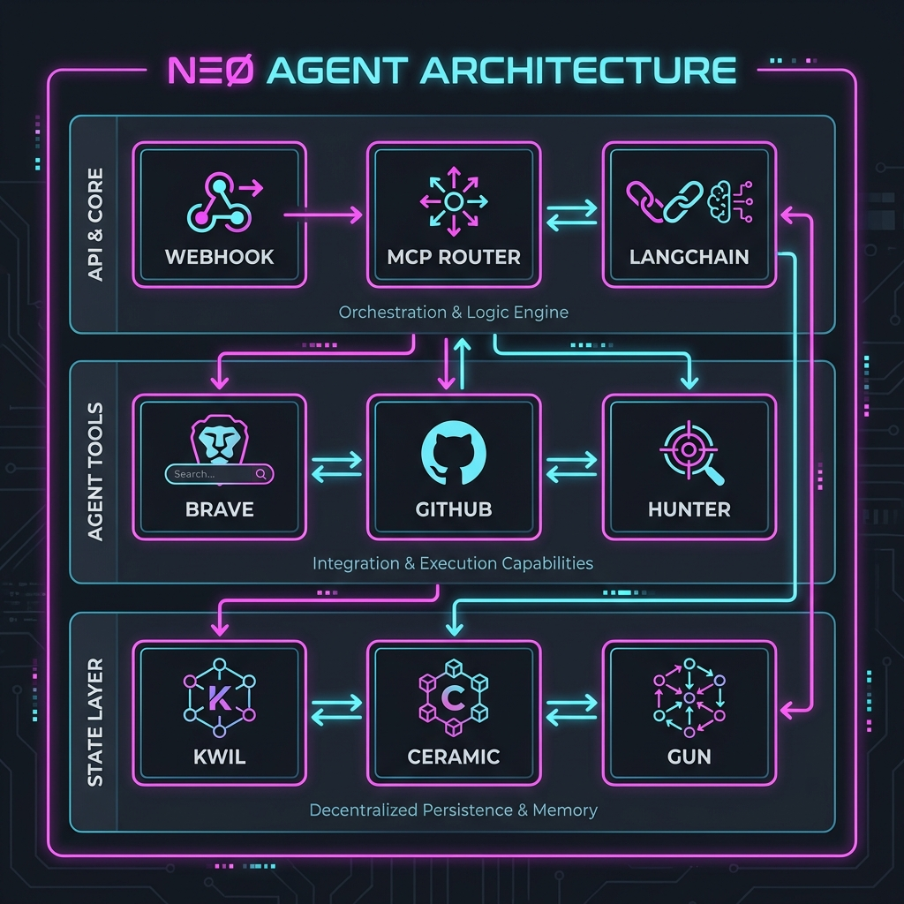

# NΞØ Agent Full

**NΞØ Agent Template - State Layer v2.5**

An advanced autonomous AI agent with persistent memory, external tool integration via MCP (Model Context Protocol), and multi-layer state management.

---

## Why this exists

Most AI agents are stateless, ephemeral and forget everything when they restart.

**NΞØ Agent** exists to enforce one idea:
**your agent must remember, reason with external data, and persist its knowledge**.

If the process dies, memory does not.

---

## What you get

*   **Persistent Memory**: Kwil SQL database for lead management and state
*   **External Intelligence**: 33+ tools via MCP (Brave Search, GitHub, Fetch)
*   **Autonomous Reasoning**: LangGraph ReAct agent with tool calling
*   **Multi-Layer State**: Ceramic, GUN, IPFS support for decentralized persistence
*   **Production Ready**: Webhook API, structured JSON responses, error recovery

---

## Get Started

For installation instructions and testing procedures, please refer to the [**Setup & Testing Guide**](./docs/SETUP_TESTING.md).

---

## Documentation

Explore the technical details and guides in the [**Documentation folder**](./docs/README.md).

---

## Related Repositories

- **Dashboard**: [neo-agent-dashboard](https://github.com/neomello/neo-agent-dashboard) - Next.js frontend for monitoring and control

---

## Architecture

---

## Tech Stack

- **Runtime**: Node.js 20, TypeScript
- **AI/ML**: LangChain, LangGraph, Google Gemini
- **Database**: Kwil (SQL), Ceramic, GUN
- **Storage**: IPFS (Web3.Storage)
- **APIs**: Hunter.io, Twitter/X, Brave Search, GitHub
- **Protocol**: MCP (Model Context Protocol)

---

## Why sponsor this

This work is public, but it is not free.

Sponsoring means supporting:

*   Autonomous agents with persistent memory
*   Decentralized state management patterns
*   Infrastructure that outlives processes

You are not sponsoring a person.
You are sponsoring a **protocol**.

If this agent saved you time, prevented data loss, or clarified your AI workflow, sponsorship is simply returning value to the system.

---

## Repository

[https://github.com/neomello/neo-agent-full](https://github.com/neomello/neo-agent-full)

---

## Contact

[neo@neoprotocol.space](mailto:neo@neoprotocol.space)

 

 

<i>"Expand until silence becomes structure."</i>

 

---

> This agent evolves.
> Forgetfulness does not.

