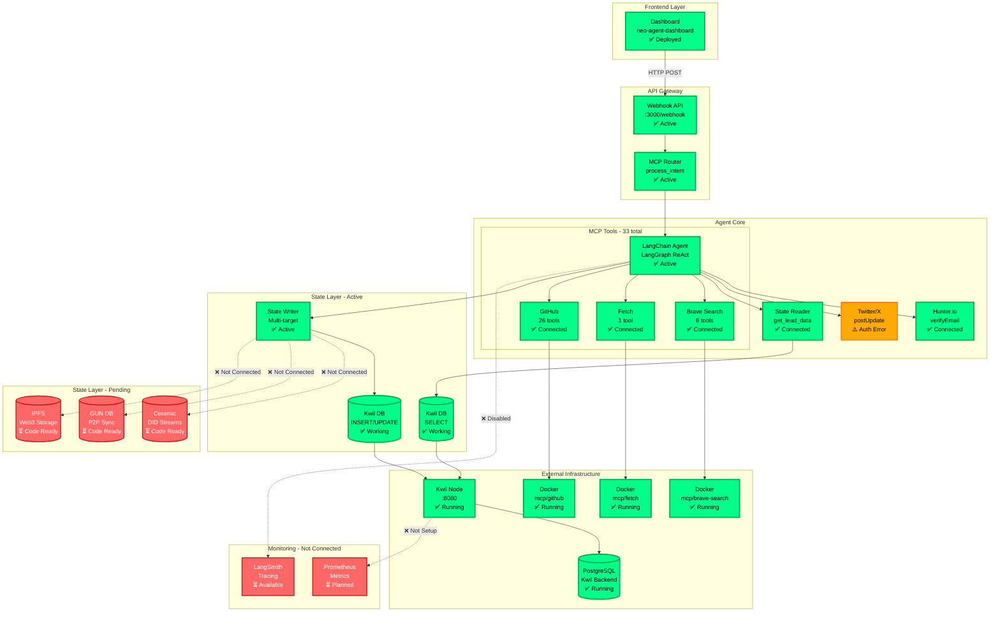
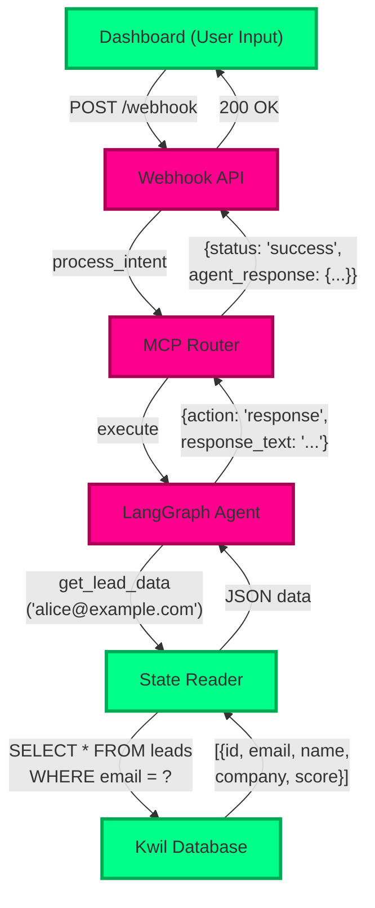
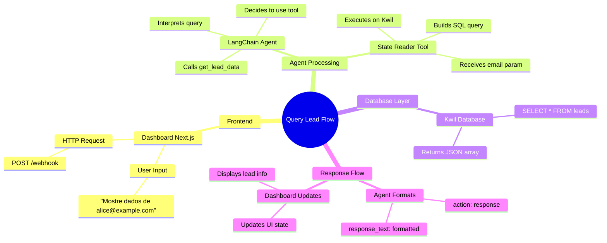
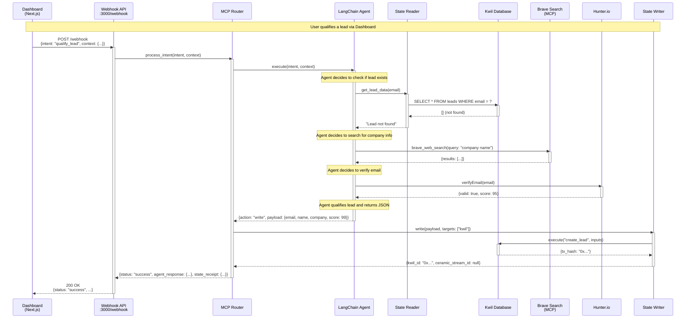

# 📊 NΞØ Agent - Visual Architecture & Flows

This page contains the visual documentation of the NΞØ Agent system. All diagrams are rendered directly by GitHub using Mermaid.

---

## 🏗️ General System Architecture
The high-level structure of the neo-agent system, showing layers from Frontend to External Infrastructure.

---

## 🔍 Lead Query Flow (Read-Only)
How the agent fetches existing memory from the state layer.

### 🧠 Mindmap: Lead Query Decision
How the agent thinks when processing a lead query.

---

## ⚡ Lead Qualification Flow (Write-Memory)
Step-by-step sequence of searching, verifying, and persisting new lead data.

